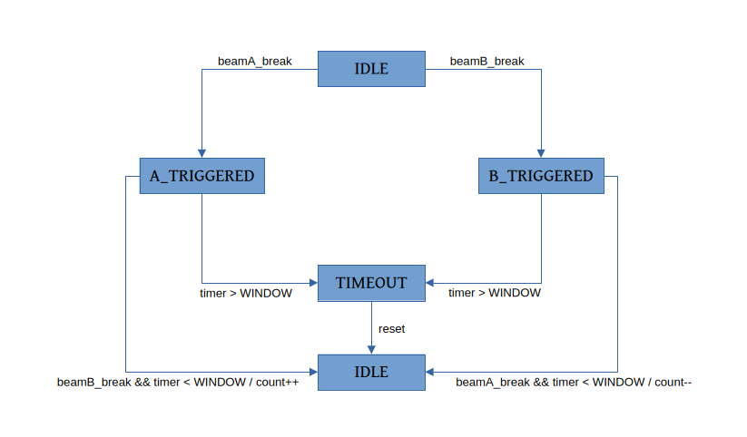

```
                                      █████╗  ██████╗       ███████╗██████╗ ████████╗
                                     ██╔══██╗██╔════╝       ██╔════╝██╔══██╗██╔═════╝
                                     ███████║██║            ███████╗██████╔╝████████╗  
                                     ██╔══██║██║            ╚════██║██╔══██╗╚═════██║ 
                                     ██║  ██║╚██████╗███████╗██████║██║  ██║████████╗
                                     ╚═╝  ╚═╝ ╚═════╝╚══════╝╚═════╝╚═╝  ╚═╝╚═══════╝
                              
                                         AC — SHUTTING REMINDER SYSTEM (AC-SRS)
                                        Smart Occupancy + Temperature-Based AC Alarm
```

---

<p align="center">
  
  
  
  
</p>

<p align="center">
  <b>“Stop wasting AC power in empty rooms. Detect, remind, save.”</b>
</p>

---

#  **What Is AC-SRS?**

**AC-SRS (AC–Shutting Reminder System)** is a smart, Arduino-based system that tracks room occupancy in real time, monitors room temperature, and automatically triggers a reminder alarm when the AC is left on while no one is in the room.

It provides a simple but effective energy-saving mechanism for:

* Classrooms
* Laboratories
* Meeting rooms
* Dorm rooms
* Public spaces
* Offices or shared areas prone to AC negligence

This is more than just a “people counter” — it’s a **practical energy-efficiency tool**.

---

#  **Key Features**

* **Bidirectional occupancy detection** using dual laser–LDR pairs

  * A → B = Person enters
  * B → A = Person exits
* **Advanced analog signal processing**

  * Moving Average Filtering
  * Median Spike Rejection
  * Adaptive Baseline Drift
  * Dynamic Thresholding
* **Non-blocking State Machine** (no `delay()`)
* **Temperature sensing (AHT20)** for AC-cooling detection
* **Automatic Reminder Logic:**
  If `people == 0` **and** `temperature < threshold` → buzzer ON
* **CSV Serial Logging**
* **Modular firmware architecture** (clean, maintainable)
* Designed to survive noisy analog environments

---

#  **How the System Works**

<p align="center">
  
</p>

1. Two laser beams point directly at two LDR modules.
2. When someone passes through the doorway, the beams break in sequence.
3. Sequence direction determines whether a person **enters** or **exits**.
4. The system tracks the number of people inside.
5. The AHT20 continuously monitors room temperature.
6. AC reminder triggers automatically when:

   ```
   people == 0 
   AND 
   temperature < AC_THRESHOLD
   ```

   → Buzzer ON (reminder to shut the AC off)

---

#  **Repository Structure**

```
AC-SRS/
│
├── README.md
├── LICENSE
├── .gitignore
│
├── docs/
│   ├── architecture.md
│   ├── state-machine-diagram.png
│   ├── wiring-diagram.png
│   ├── calibration-notes.md
│   └── test-protocol.md
│
├── firmware/
│   ├── src/
│   │   ├── main.ino
│   │   ├── config.h
│   │   ├── state_machine.h
│   │   ├── filtering.h
│   │   ├── sensor_processing.h
│   │   ├── occupancy_logic.h
│   │   └── utils.h
│   └── platformio.ini
│
├── hardware/
│   ├── schematic.png
│   ├── board-layout.png
│   └── bill-of-materials.md
│
├── data/
│   ├── logs/
│   └── analysis/
│
└── examples/
```

---

# 🔌 **Wiring Overview**

| Component         | Arduino                         |
| ----------------- | ------------------------------- |
| LDR A (module AO) | A0                              |
| LDR B (module AO) | A1                              |
| Laser A           | 5V & GND                        |
| Laser B           | 5V & GND                        |
| AHT20 Temp Sensor | SDA → A4, SCL → A5              |
| Buzzer            | D9 (recommended via transistor) |

<p align="center">
  
</p>

---

#  **Firmware Architecture**

| File                    | Description                                     |
| ----------------------- | ----------------------------------------------- |
| **main.ino**            | Main loop + initialization                      |
| **config.h**            | Config parameters (thresholds, filters, timing) |
| **state_machine.h**     | A→B / B→A direction logic                       |
| **filtering.h**         | Moving average + median filtering               |
| **sensor_processing.h** | Analog beam-break detection                     |
| **occupancy_logic.h**   | People counter + AC reminder                    |
| **utils.h**             | CSV logging & helper functions                  |

> Clean separation = easier debugging, clearer logic, maintainable code.

---

#  **Reminder Logic**

```cpp
if (people == 0 && temperature < TEMP_THRESHOLD) {
    buzzer.on();
} else {
    buzzer.off();
}
```

Recommended default:

```
TEMP_THRESHOLD = 25°C
```

---

#  **Testing Protocol**

Detailed in:

```
docs/test-protocol.md
```

Checklist:

* 20× entry test
* 20× exit test
* Ambient-noise test (30 seconds)
* Save CSV in `data/logs/`
* Evaluate TPR (true positive rate) & FPR (false positive rate)

---

#  **Limitations**

* LDR modules are highly sensitive to ambient light and electrical noise
* Requires properly focused laser beam
* Long-range setups (>1 meter) may require stronger lasers
* For production-level stability: **switch to photodiode + TIA amplifier**

---

#  **Future Improvements**

* Photodiode sensor upgrade
* OLED display for on-device readouts
* ESP32 upgrade → WiFi logging dashboard
* AC auto-shutoff relay module
* RTC timestamps for reliable logging
* More advanced adaptive filtering or ML-based noise rejection

---

#  **License**

MIT License • 2025

---
